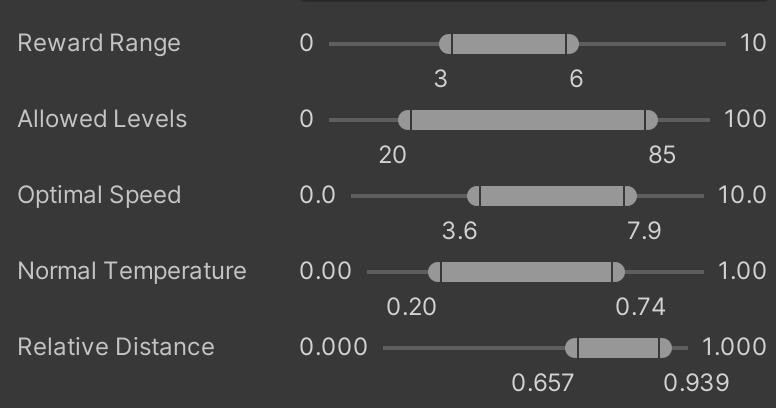

# Min/max Range Attribute
A bounded (i.e., with a minimum and maximum) range attribute for Unity's `Vector2` and `Vector2Int` fields.



## Contents
- [Features](#features)
- [Importing](#importing)
	- [Import using a git URL](#import-using-a-git-url)
	- [Import with OpenUPM](#import-with-openupm)
	- [After importing](#after-importing)
- [Usage](#usage)
- [Compatibility and dependencies](#compatibility-and-dependencies)
- [Contributing](#contributing)
- [Getting help](#getting-help)
- [License](#license)

## Features


## Importing
The first step is to import the library into your Unity project. There are two ways to do so: via the Package Manager using a git URL, and via OpenUPM.

### Import using a git URL
This approach uses Unity's Package Manager to add the attribute to your project using the repo's git URL. To do so, navigate to `Window > Package Manager` in Unity. Then click on the `+` and select "Add package from git URL":


Next, enter the following in the "URL" input field to install the latest version of TTG:
```
https://github.com/matheusamazonas/min_max_range_attribute.git?path=Assets/Libraries/MinMaxRangeAttribute#latest
```
Finally, click on the "Add" button. The importing process should start automatically. Once it's done, the attribute can be used in the project. 

### Import with OpenUPM
TTG is available as a package on [OpenUPM](https://openupm.com/packages/com.sneakysquirrellabs.terracedterraingenerator/). To import TTG into your project via the command line, run the following command:
```
openupm add com.sneakysquirrellabs.minmaxrangeattribute
```
Once the importing process is complete, the attribute can be used in the project. 

## Usage

## Compatibility and dependencies
TTG requires Unity 2021.3.X or above, its target API compatibility level is .NET Standard 2.1, and it does not depend on any other packages.

## Contributing
If you would like to report e bug, please create an [issue](https://github.com/matheusamazonas/min_max_range_attribute/issues). If you would like to contribute with bug fixing or small improvements, please open a Pull Request. If you would like to contribute with a new feature,  [contact the developer](https://matheusamazonas.net/contact.html).  

## Getting help
Use the [issues page](https://github.com/matheusamazonas/min_max_range_attribute/issues) if there's a problem with your setup, if something isn't working as expected, or if you would like to ask questions about the tool and its usage.

## License
Terraced Terrain Generator is distributed under the terms of the MIT license. For more information, check the [LICENSE](LICENSE) file in this repository.